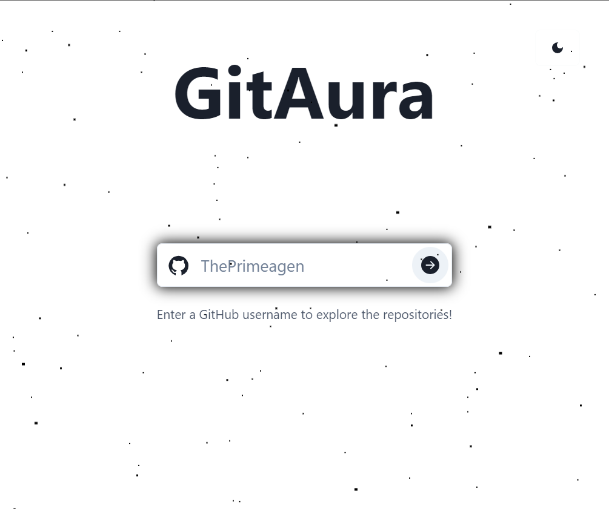
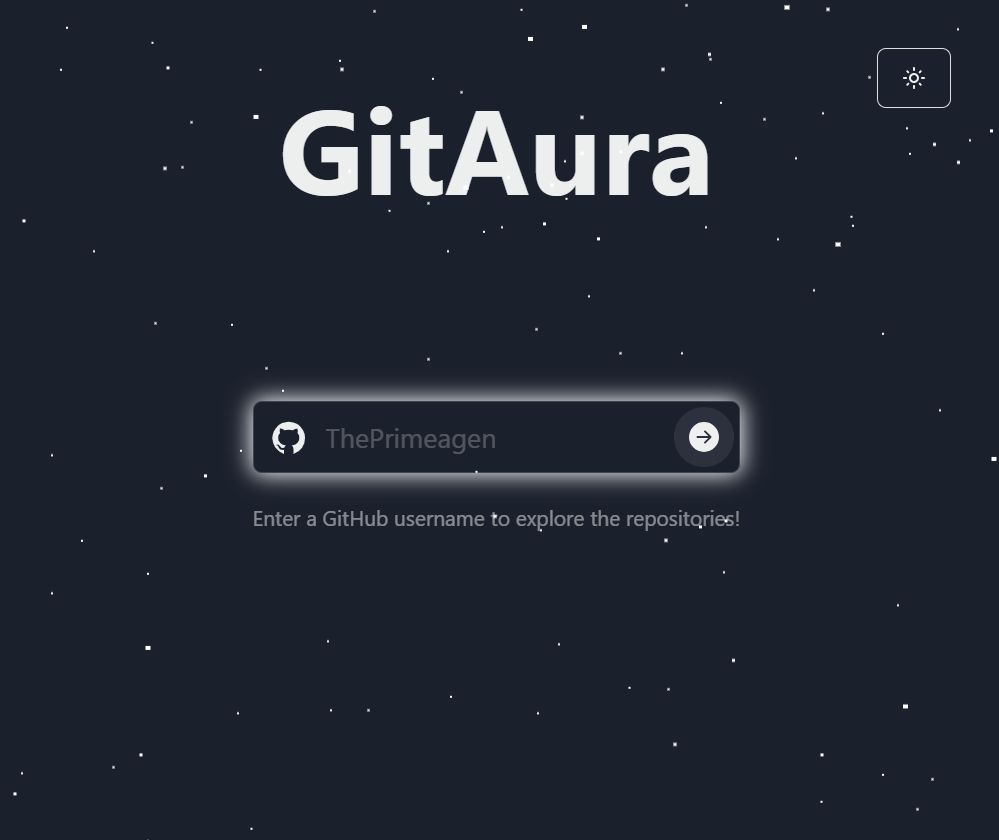
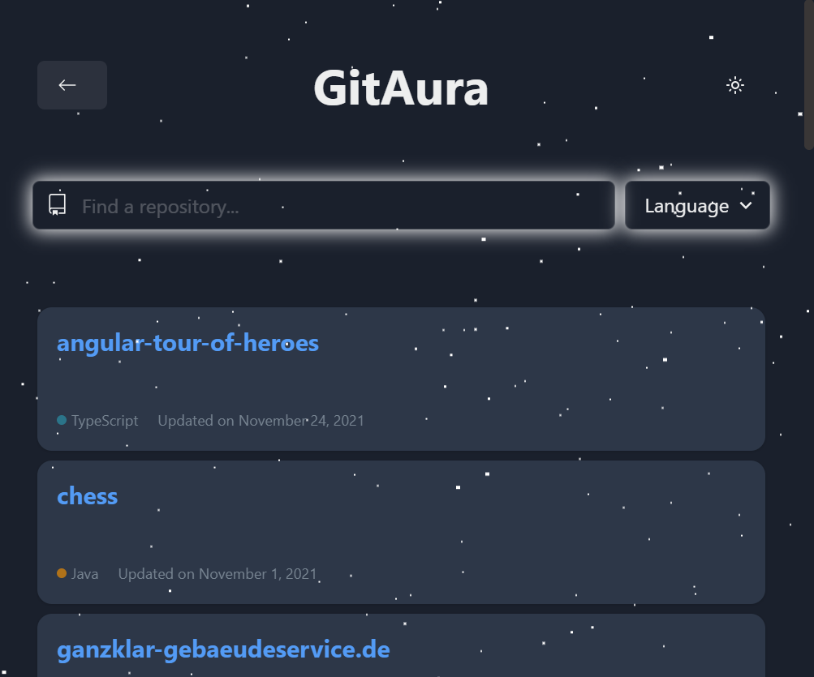

# GitAura

    

## 🌐 Live Demo
Check out the live demo of GitAura [here](https://rami-nk.github.io/gitaura/). Experience the full functionality of the tool without the need to set it up locally.

## 🌟 Description
GitAura is a web application developed as part of a coding challenge for [MVST](https://www.mvst.co/home). It is a web-based tool designed to enhance the experience with GitHub repositories. It offers an intuitive interface for searching GitHub users and provides a nice visualization of repository statistics, incorporating a sleek, starry-themed design. It uses the GitHub API for fetching the data.

### Landing Page
<div align="center">
  <strong>Light Mode</strong><br>
  
</div>

<div align="center" style="margin-top: 20px;">
  <strong>Dark Mode</strong><br>
  
</div>

### Repository View Page
<div align="center" style="margin-top: 20px;">
  <strong>Explore GitHub Repositories</strong><br>
  
</div>

## 🚀 Features
- **🔍 User Search**: Search for any GitHub user with ease.
- **📊 Repository Visualization**: Display repositories in an organized, visually appealing layout.
- **🔧 Modern Web Technologies**: Built with React using Typescript with Chakra UI as UI library and Octokit for data-fetching.
- **📈 Statistics**: Insightful repository details including stars, forks, and more.
- **📱 Responsive Design**: A seamless experience across various devices.
- **🌙 Dark Mode**: A beautiful, eye-friendly starry theme.

## 🛠 Getting Started

### Prerequisites
Before you begin, ensure you have met the following requirements:
- [Node.js](https://nodejs.org/) (version 12 or newer)
- [npm](https://www.npmjs.com/) or [yarn](https://yarnpkg.com/) as your package manager.
- [Vite](https://vitejs.dev/) for building and serving the application.

### Installation
Follow these steps to get your development environment running:

1. Clone the repository:
```sh
git clone https://github.com/rami-nk/gitaura.git
```

2. Navigate to the project directory:
```sh
cd GitAura
```

3. Install dependencies:
```sh
npm install # or yarn
```

4. Start the development server:
```sh
npm run dev # or yarn dev
``` 
After running the development server, GitAura will be available at http://localhost:5174 (or another port if 5174 is in use).

## 💡 Usage
Once GitAura is running, you can use it by navigating to http://localhost:5174 in your web browser. Enter a GitHub username in the search bar to view and analyze their repositories.

## 🧪 Run Tests
To ensure the quality and correctness of the application, a suite of tests has been provided. Follow these steps to run the tests:

```sh
npm test
```
This will execute the test suite and output the results. The tests cover the services, the hooks and some components.

## ⚙️ Continuous Integration and Deployment
This project uses GitHub Actions for Continuous Integration (CI) and Continuous Deployment (CD):

- **CI**: Every push and pull request triggers the automated execution of the test suite, ensuring code changes do not break existing functionality.
- **CD**: On every merge into the `main` branch, the application is automatically built and deployed to GitHub Pages.

You can view the CI/CD workflows in the `.github/workflows` directory. These workflows are responsible for providing a seamless integration and deployment process, ensuring that the latest version of the application is always available and stable.

## 🚀 Future Improvements

This project of course can be further improved by enhancing its funcionality and user experience and adding additional features. Below is a checklist of potential improvements and features I'm considering:

- [ ] **Enhanced UI Design**: Refine the look and feel for a more engaging user experience.
  - [ ] Implement a more visually appealing color scheme.
  - [ ] Introduce subtle animations and transitions between pages.

- [ ] **Improved Navigation**: Enhance user navigation within the application.
  - [ ] Add a "Scroll to Top" button for easy navigation back to the top of the page.
  - [ ] Implement a sticky filter bar to allow filtering without needing to scroll up.

- [ ] **User Information Expansion**: Provide more comprehensive information about GitHub users.
  - [ ] Display additional user metadata such as bio, location, and blog links.
  - [ ] Include a section for user statistics like total stars, followers, and following.

- [ ] **Footer Addition**: Integrate a footer for additional navigation and information.
  - [ ] Add links to the repository, contact information, and other resources.
  - [ ] Include a section for legal information and acknowledgments.

## 📜 License
Distributed under the MIT License. See [`LICENSE`](LICENSE) for more information.
